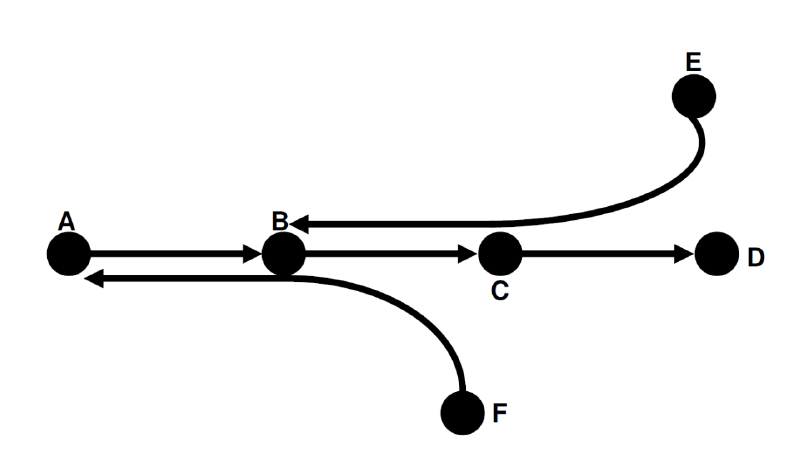

# tp2_posix_gl4
## Exclusion Mutuelle en POSIX

Soient 6 stations sous-sol de Berlin A, B, C, D, E, F liées par 3 lignes de Métro : MR1, MR2 et MR3. MR1 lie la station A à la station D, MR2 lie la station F à la station A, MR3 lie la station E à la station B.

On veut gérer ces lignes de Métro en respectant les rèles suivantes :
* Plusieurs Métros peuvent partir simultanément de A
* Plusieurs Métros peuvent partir simultanément de F
* Plusieurs Métros peuvent partir simultanément de E
* A un instant donné, chaque segment de ligne de Métro (segments AB, BC, CD, BF et EC) ne peut être utilisé que par un Métro au plus
* Chaque Métro prend 6mn pour occuper un segment
